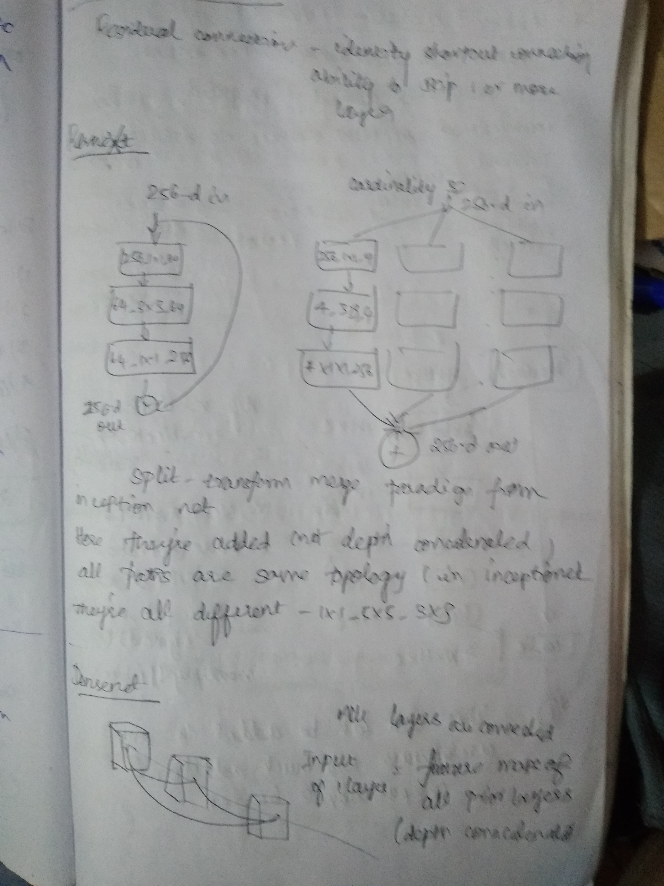
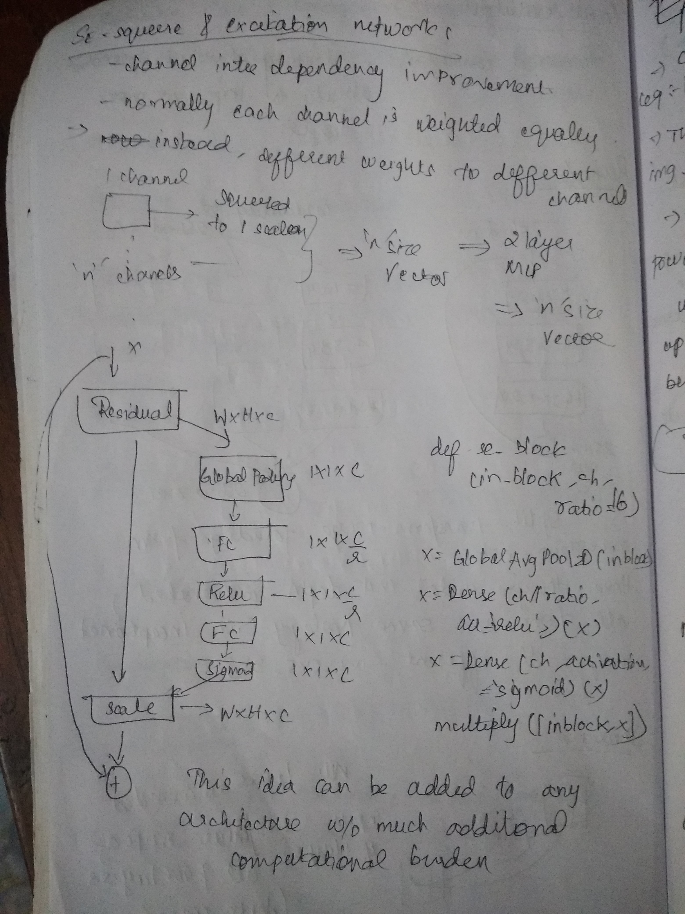
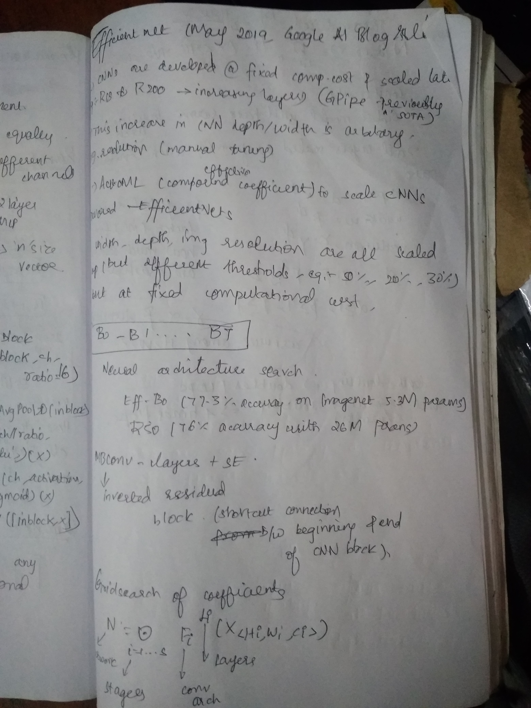
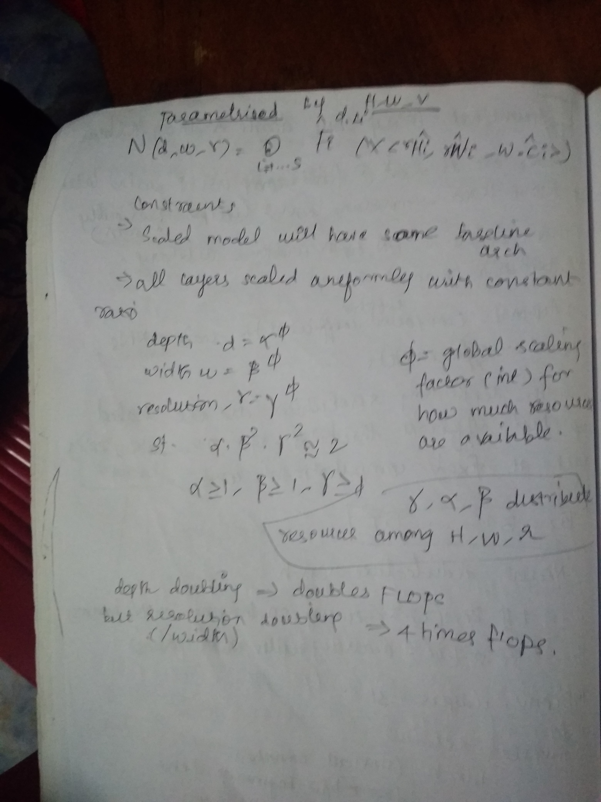

# DL-resources
Collection of useful DL resources found online

## CV strategy
- [k-fold vs stratified kfold](https://www.google.com/search?q=when+to+use+kfold+and+when+to+use+stratified+k+fold&oq=when+to+use+kfold+and+when+to+use+stratified+k+fold&aqs=chrome..69i57.12117j0j1&sourceid=chrome&ie=UTF-8)

## Learning rate finder

## LR schedulers
- https://www.jeremyjordan.me/nn-learning-rate/
- [Cosine Annealing - Papers with code](https://paperswithcode.com/method/cosine-annealing)
- [Medium post on SGDR](https://towardsdatascience.com/https-medium-com-reina-wang-tw-stochastic-gradient-descent-with-restarts-5f511975163)

- With Higher learning rates, learning is faster (good until we start diverging)
- As we train longer, we tend to approach global minima, so need to reduce lr. Annealing is the part where we train with lower lr to find stable region (envisioned as plateau, where small changes in input doesnt lead to much change in loss function).
- Cyclic Learning rates - start from one end of sprectrum and increase / decrease the lr using a linear / exp / cosine like function
- warm restarts - Periodically Reseeting lr to lr_max helps us avoid `overfitting regions`, `saddle points`. Warm refers to the point that we continue to use the weights obtained after training for some time and not starting from some pre-defined initialization (random, zero etc)
- lr_max is found using the lr_range test proposed by Leslie Smith. 
- Two major options 
	- Cosine Annealing with warm restarts (Cosine is more aggressive annealing strategy)
	- One cycle lr (across the entire training cycle - linear / cosine annealing)
	- Generally One cycle lr is less over fitting than Cosine Annealing with warm restarts

## Image Augumentation techniques
- [Rand augument](https://github.com/ildoonet/pytorch-randaugment)

## Loss functions

## Transformers

## LSTM - from scratch

## Pytorch lightning
- [Tensorboard in PT-L](https://learnopencv.com/tensorboard-with-pytorch-lightning/)
- 

## Optimizers

- [Comparison of different Optimizers and lr_schedulers](https://medium.com/vitalify-asia/whats-up-with-deep-learning-optimizers-since-adam-5c1d862b9db0)
- SGD with momentum and wieght decay is generally SOTA
- Combined with Cosine Annealing with warm restarts
- Need to be explored further

## Kaggle discussions
- [snapshot learning and cyclic lr](https://www.kaggle.com/c/tgs-salt-identification-challenge/discussion/65347)
- [MoA 1st place solution](https://www.kaggle.com/c/lish-moa/discussion/201510#1102840)

## Resnet architectures and variants
- [Simple google search](https://www.google.com/search?q=resnest+vs+resnet&oq=resnest+vs+resnet&aqs=chrome..69i57.8285j0j1&sourceid=chrome&ie=UTF-8)
- [efficientnet vs resnet](https://www.google.com/search?sxsrf=ALeKk036AhcaMIAokeRmDgNNIimBiwpANA%3A1610412708874&ei=pPL8X-3rNIOO4-EPq4qzyAU&q=efficientnet+vs+resnet&oq=efficie&gs_lcp=CgZwc3ktYWIQAxgBMgsIABCxAxDJAxCRAjIECAAQQzIFCAAQkQIyBwgAELEDEEMyBAgAEEMyBwgAELEDEEMyAggAMgIIADICCAAyAggAOgQIABBHOgQIIxAnOggIABDJAxCRAjoICAAQsQMQgwE6DgguELEDEIMBEMcBEKMCOggILhCxAxCDAToFCAAQsQNQ7pUBWMSfAWDRqgFoAHAEeAGAAaYCiAGkBpIBBTYuMC4xmAEAoAEBqgEHZ3dzLXdpesgBCMABAQ&sclient=psy-ab)

- 
- 
- 
- 
